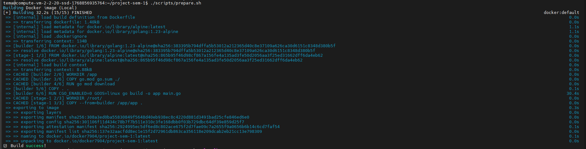
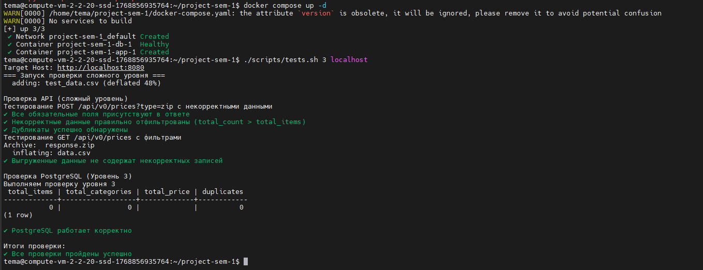

# Финальный проект 1 семестра

REST API сервис для загрузки и выгрузки данных о ценах.

## Требования к системе

Написать требования к ОС или аппаратному обеспечению (если есть)

## Установка и запуск

Как установить и запустить приложение локально?

## Тестирование

Директория `sample_data` - это пример директории, которая является разархивированной версией файла `sample_data.zip`

Какие тесты проходит приложение? Можно предоставить команду для тестов или описание тестов со скришотами/видео.

## Контакт

К кому можно обращаться в случае вопросов?

## Демонстрация работы

### 1. Локальная сборка (Build)
Скрипт `prepare.sh` успешно собирает Docker-образ приложения. Это подтверждает, что `Dockerfile` корректен и код компилируется без ошибок.

### 2. Локальное тестирование
Успешный запуск контейнеров через `docker compose` и прохождение всех интеграционных тестов (Сложный уровень).

