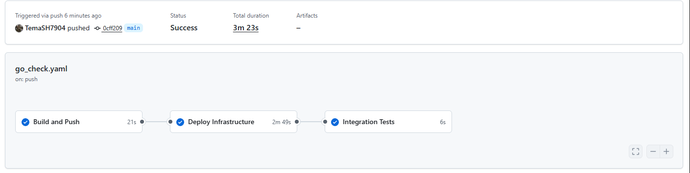
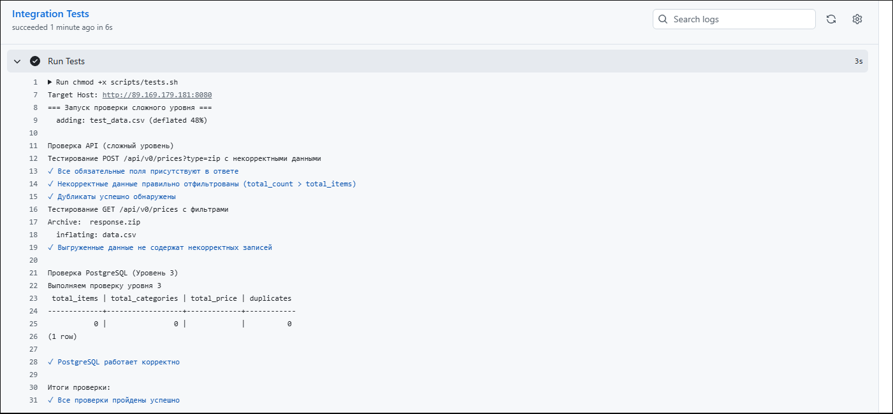
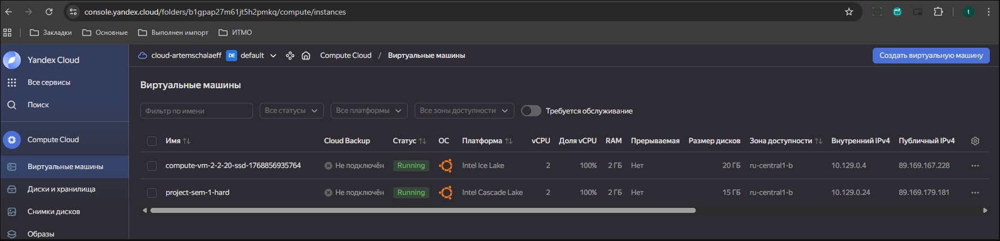
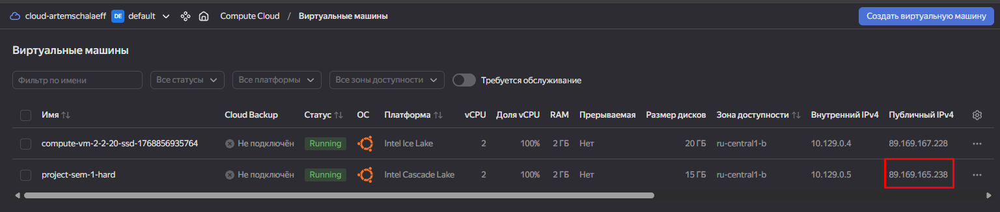
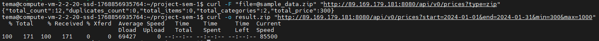

# Финальный проект 1 семестра

REST API сервис для загрузки и выгрузки данных о ценах.

## Требования к системе

* **ОС**: Linux (Ubuntu 22.04 LTS).
* **Аппаратное обеспечение**: 1 vCPU, 2 GB RAM.
* **ПО**: Docker, Docker Compose, YC CLI.

## Установка и запуск

Как установить и запустить приложение локально?

1. Клонируйте репозиторий.
2. Выполните команду:
   ```bash
   docker compose up -d --build
   ```
3. Сервис будет доступен по адресу `http://localhost:8080`.
4. База данных PostgreSQL автоматически развернется на порту 5432 с пользователем `validator` и паролем `val1dat0r`.

## Тестирование

Директория `sample_data` — это пример директории, которая является разархивированной версией файла `sample_data.zip`.

Приложение проходит комплексное тестирование:
* **POST /api/v0/prices**: Загрузка архивов (ZIP/TAR), валидация данных, проверка на дубликаты.
* **GET /api/v0/prices**: Фильтрация по датам (`start`, `end`) и цене (`min`, `max`) с генерацией выходного архива.

Команда для запуска облачных тестов (замените `<PUBLIC_IP>` на адрес вашего сервера):

```bash
# Запуск скрипта тестов по публичному IP
./scripts/tests.sh 3 <PUBLIC_IP>
```
*Примечание: порт 8080 подставляется скриптом автоматически.*

## Контакт

К кому можно обращаться в случае вопросов?

* **GitHub**: [@TemaSH7904](https://github.com/TemaSH7904)

## Демонстрация работы

### 1. Локальная сборка (Build)
Скрипт `prepare.sh` успешно собирает Docker-образ приложения. Это подтверждает, что `Dockerfile` корректен и код компилируется без ошибок.


### 2. Локальное тестирование
Успешный запуск контейнеров через `docker compose` и прохождение всех интеграционных тестов (Сложный уровень).


### 3. CI/CD Pipeline (GitHub Actions)
Автоматическая проверка каждого коммита. Пайплайн разделен на 3 этапа: сборка, развертывание инфраструктуры (IaC) и интеграционные тесты на живом сервере.


**Лог успешного прохождения тестов (Job: Integration Tests):**
На скриншоте ниже видно выполнение скрипта `tests.sh` внутри раннера GitHub Actions. Все проверки (загрузка некорректных данных, дубликаты, фильтрация) пройдены успешно.


### 4. Облачная инфраструктура и результаты (Yandex Cloud)
**Docker Hub**: Образ успешно опубликован в публичном репозитории.


**Yandex Cloud**: Виртуальная машина автоматически создана и запущена, приложение доступно по внешнему IP.


**Результаты тестов (Terminal)**:
Ответ сервера с расчетом статистики и подтверждение работы эндпоинтов.


Для получения такого результата используются следующие команды:

**1. POST-запрос (Загрузка архива):**
```bash
curl -F "file=@sample_data.zip" "http://<PUBLIC_IP>:8080/api/v0/prices?type=zip"
```

**2. GET-запрос (Выгрузка с фильтрацией):**
```bash
curl -o result.zip "http://<PUBLIC_IP>:8080/api/v0/prices?start=2024-01-01&end=2024-01-31&min=300&max=1000"
```